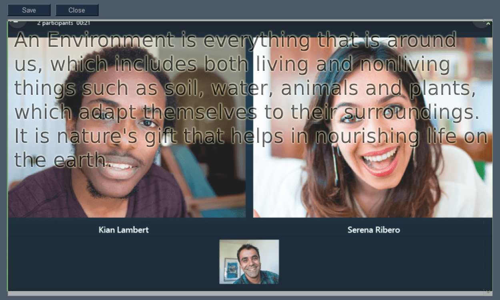

# Transparent Notes v1.0

  

Ever forgot your script during an online meeting?? Hard to answer question while teachers asking?? Forgetting things which you are taught??

### Here is your solution 😉😉

Introducing Transparent Notes, the window will act as an overlay to your preferred meet. Type or paste anything you want.

